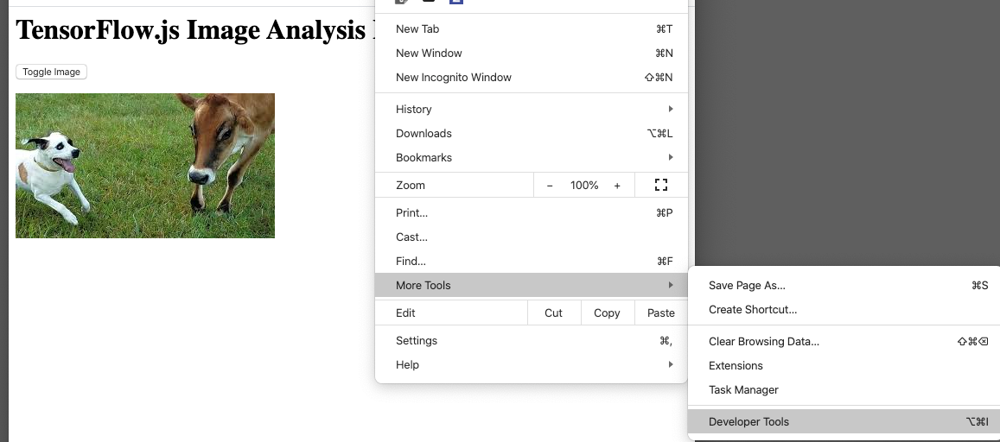
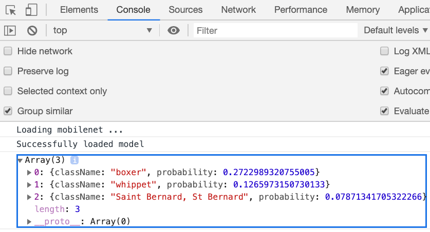
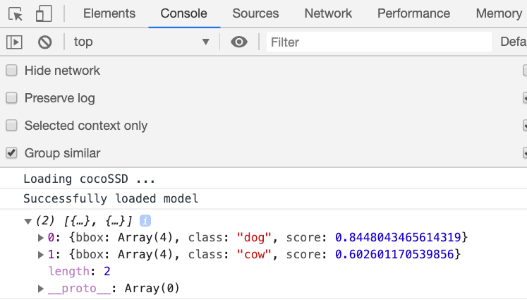

## <a id=using-image-mms-pattern></a> Using the MMS Example for ML model updates with Deployment Policy


Make sure you have completed the [precondition](https://github.com/jiportilla/img-MMS/blob/master/docs/preconditions.md) steps before starting this section. Particularly verifying that service and deployment policies have been configured and are compatible with this node policy.

- Get the required node policy and configuration files:
```bash
wget https://raw.githubusercontent.com/jiportilla/img-MMS/master/horizon/node_policy.json
wget https://raw.githubusercontent.com/jiportilla/img-MMS/master/horizon/hzn.json
```

- Below is the `node_policy.json` file you obtained earlier:

```json
{
  "properties": [
    {
       "name": "sensor",
       "value": "camera"
      }
  ],
  "constraints": [
	"location == backyard"
  ]
}
```
- It provides values for one `property` (`sensor`), that will affect which services get deployed to this edge node, and states one `constraint` (`location`).

Run the following commands to set the environment variables needed by the `object.json` file in your shell:

```bash
export ARCH=$(hzn architecture)
eval $(hzn util configconv -f hzn.json)
```

1. Register your edge device with this node policy:

```bash
hzn register --policy node_policy.json
```

2. When the registration completes, use the following command to review the Node Policy:

```bash
hzn policy list
```

- Notice that in addition to the one `property` stated in the `node_policy.json` file, Horizon has added a few more: `openhorizon.cpu`, `openhorizon.arch`, and `openhorizon.memory`. Horizon provides this additional information automatically and these `properties` may be used in any of your Policy `constraints`.

4. The edge device will make an agreement with one of the IEAM agreement bots (this typically takes about 15 seconds). Repeatedly query the agreements of this device until the `agreement_finalized_time` and `agreement_execution_start_time` fields are filled in:

```bash
hzn agreement list
```

5. After the agreement is made, list the edge service docker container that has been started as a result:

```bash
sudo docker ps
```


6. See the `image.demo-mms` service output:

  on **Linux**:

  ```bash
  sudo tail -f /var/log/syslog | grep DEBUG
  ```

7. Open Chrome and navigate to `HTTP://HOSTNAME:9080` where `HOSTNAME`=Node Host Name or IP address


8. Open the Web Console in `More Tools \ Developer tools`



9. After a few seconds, you will see a message indicating the initial model was load, click on the picture or `Toggle image` button to see the Image analysis results

10. Notice the difference in the model results between the two example pictures, you will observe less precision in pictures with multiple objects. Let's see how to update the ML model running on the edge node using the MMS.




11. Before publishing the new ML model, get and review the `metadata` file needed to update ML models using MMS publish capabilities

```bash
wget https://raw.githubusercontent.com/jiportilla/img-MMS/master/mms/object.json
```

- Below is the `object.json` file you obtained in step above:

```json
{
  "objectID": "index.js",
  "objectType": "model",
  "destinationOrgID": "$HZN_ORG_ID",
  "destinationPolicy": {
    "properties": [
      {
       "name": "location",
       "value": "backyard"
      }
    ],
    "constraints": [
        "sensor == camera"
     ],
    "services": [
       {
	 "orgID" : "$HZN_ORG_ID",
         "arch": "$ARCH",
         "serviceName" : "$SERVICE_NAME",
         "version": "$SERVICE_VERSION"
       }
    ]
  }, 
  "expiration": "",
  "version": "1.0.0",
  "description": "image demo with tensorflow models",
  "activationTime": ""
}
```

12. Get and publish the `index.js` file as a new MMS object to update the existing ML model with:
```bash
wget https://raw.githubusercontent.com/jiportilla/img-MMS/master/mms/index.js

hzn mms object publish -m object.json -f index.js
```

13. View the published MMS object:
```bash
hzn mms object list -t model -i index.js -d
```

A few seconds after the `status` field changes to `delivered` you will see in the console the output of the image detection service change from 

**loading MobileNet...**

to 

**Loading cocoSSD ...**


14. Next, test both images, you will observe better results in images with multiple objects:




Optional:

15. Delete the published mms object with:
```bash
hzn mms object delete -t model --id index.js
```

16. Unregister your edge node, which will also stop the `image.demo-mms` service:

```bash
hzn unregister
```

17. Remove the business policy:

```bash
hzn exchange business removepolicy image.demo-mms.policy
```

18. Remove the service policy:

```bash
hzn exchange service removepolicy image.demo-mms_1.0.0_amd64
```

